# AWS DevSecOps Workshop Lab Notes
## Table of Contents
[TOC]

## Section 1: Introduction

### Learning Objectives

By the end of this workshop, you will haveaws-devsecops-workshop

* created a VPC and an EC2 instance running [Jenkins](https://jenkins.io/)
* be able to run a Jenkins security pipeline job that
	* deploys infrastructure (an EC2 instance)
	* Installs a simple application on that EC2 instance
	* Runs [RSpec](http://rspec.info/) to validate application installation success
	* Runs a capacity test using [Apache Benchmark](https://httpd.apache.org/docs/2.4/programs/ab.html)
	* Runs a security test using [OWASP ZAP](https://www.owasp.org/index.php/OWASP_Zed_Attack_Proxy_Project)
* altered the pipeline to demonstrate how to introduce errors and failures

## Section 2: Setup
### Prerequisites
See the [project README](https://github.com/stelligent/blob/master/README.md) for the full list of prerequisite tools.

In brief, the only firm requirement is having an active, and ideally empty, AWS account with full access to your AWS profile (the ability to run CloudFormation templates, configure VPCs, create EC2 instances and Internet gateways, etc.)

### Fork the Project on GitHub
While the README for this project specifies several methods for 
In order to allow for customization and testing, you will need to create a copy of the project. In order to do so, you should:

1. Ensure that you have a [GitHub](https://github.com/) account and are signed in to GitHub.
1. Navgiate to the [Github page](https://github.com/stelligent/aws-devsecops-workshop) for the DevSecOps project.
2. Click the "Fork" button at the top right to make a copy of the project into your own GitHub workspace.

## Section 3: Deploying the CloudFormation Template (Unchanged)
### Deploy Template
During your first run of the pipeline, you may safely use the original project (or your unaltered GitHub fork of the original project).

1. To do so, simply navigate to the GitHub project page and click the "Launch Stack" button.    
2. Next, verify that the selected template is the unaltered one stored in S3, then click "Next". 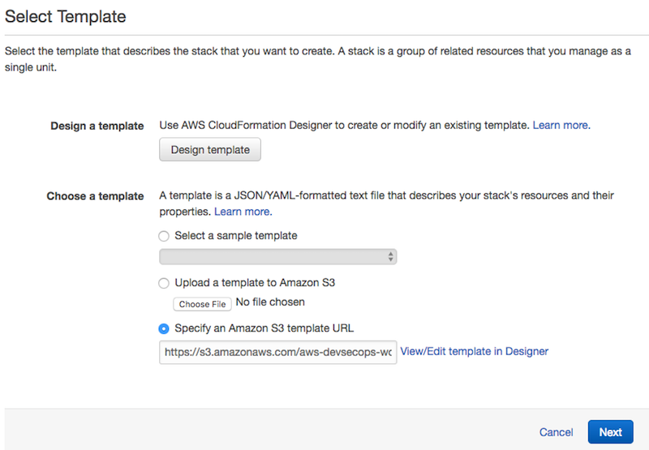  
3. For the purposes of this exercise, you may leave the details unchanged. Click "Next". 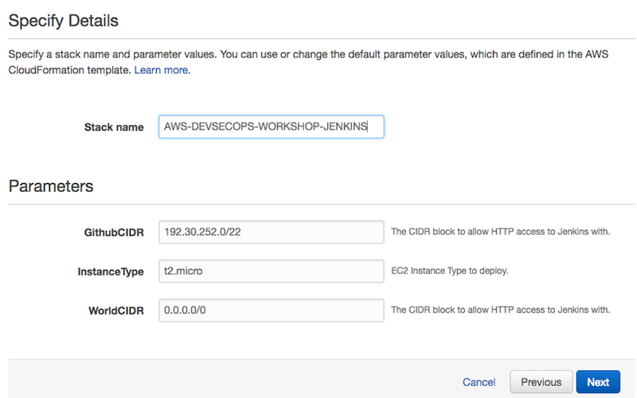  
4. You may (optionally) add tags and an IAM role to your stack. Then click "Next". 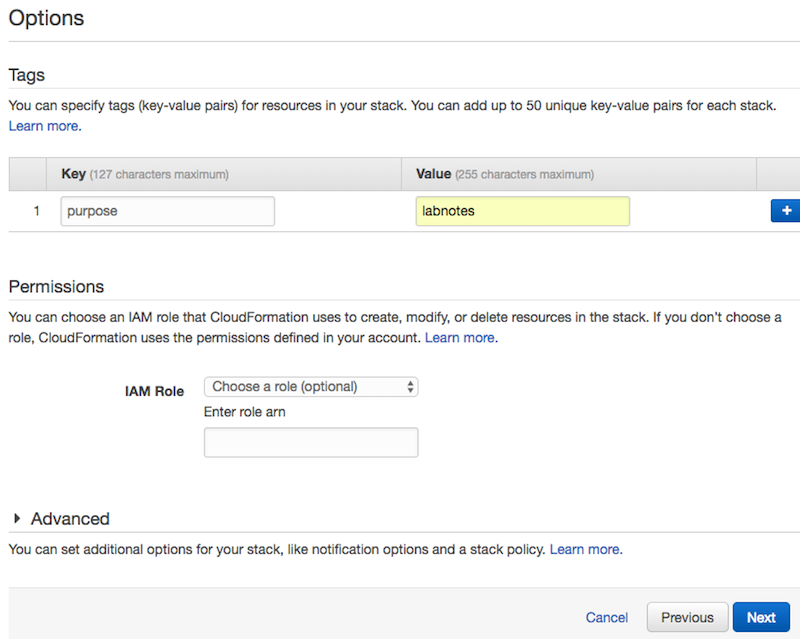  
5. Once you have completed all the configuration steps, take a moment to review the details. 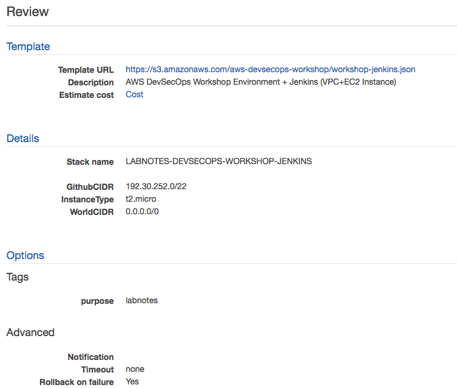  
6. Make sure to acknowledge the "CloudFormation may create IAM resources" checkbox and then click "Create". 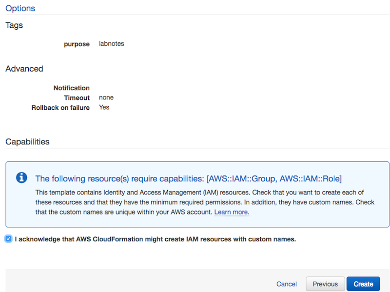  

### Monitor Stack Creation
You can keep tabs on your CloudFormation stack's creation progress via the AWS Console CloudFormation screen

  

### View Stack Results
Once the stack creation is complete, you can take a quick look at the results via the AWS Console.

#### Stack
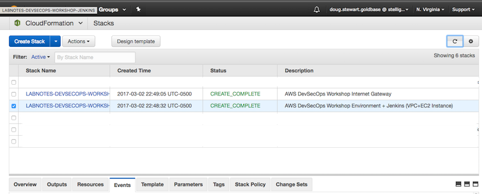  

#### VPC
  

#### EC2 Instance
Take note of the public IP adress of the Jenkins EC2 instance created during this step, as you will need to have it available to proceed on to section 4.    

## Section 4: Running the Jenkins Pipeline (Unchanged)
1. Once the initial stack has been created, you will have access to a single EC2 instance running Jenkins. Using the public IP address listed in Section 3->EC2 Instance, direct your web browser to `http://[EC2 public IP]:8080` in order to load the Jenkins login page.  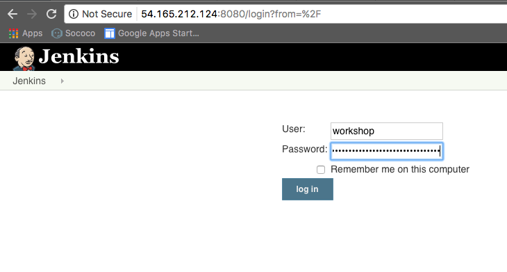  
2. Log in to the Jenkins instance using the default username (`workshop`) and password (`Fancy$Treasury!Effective!Throw^6`). You should see a view similar to this:   
3. Click the `seed-aws-devops-workshop` link under "Name" in the right-hand table. You should see the following screen. 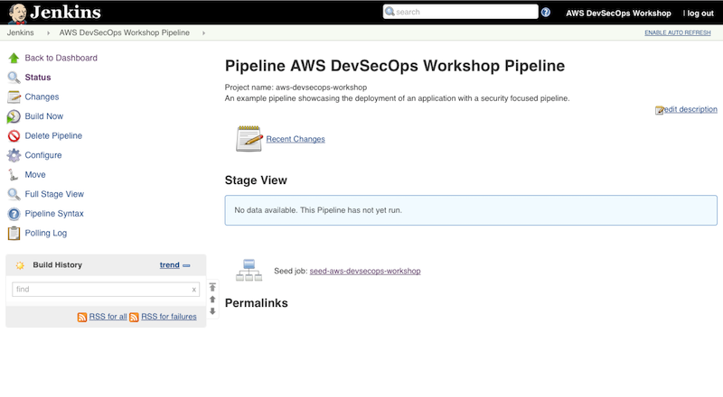  
4. Click "Build Now" in the left-hand menu. 
5. This pipeline job will run fairly quickly and create a new job entry on the dashboard, "AWS DevSecOps Workshop Pipeline".   
6. Click on "AWS DevSecOps Workshop Pipeline".
7. Click "Build" in the left-hand menu.
8. You may monitor the progress of the pipeline job as it steps through the various pipeline stages. 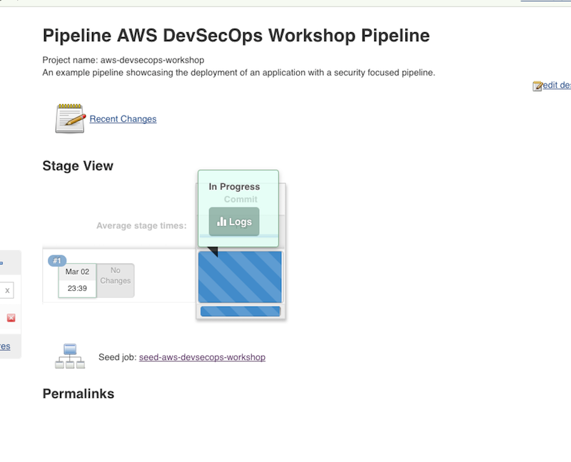  
9. Once all the pipeline steps are complete, you should see a screen similar to this: 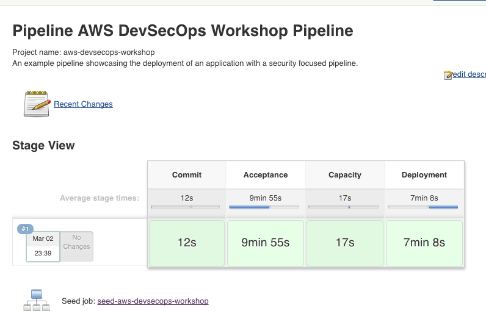  
10. Navigate back to your AWS Console and to the EC2 Instances screen. You should see a newly-created EC2 instance named "AWS DevSecOps Workshop - Jenkins - UBUNTU".   
11. Note the public IP address of the EC2 instance.
12. Direct your browser to said IP address to verify that the extremely simple Nginx installation was configured and started correctly by the build pipeline.  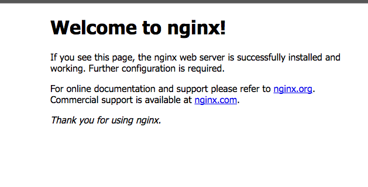  
13. You are now finished with the standard, unaltered portion of the workshop.

## Section 5: Deploying an Altered CloudFormation Template [Future/Work-in-progress] 
## Section 6: Running an Altered Jenkins Pipeline [Future/Work-in-progress] 